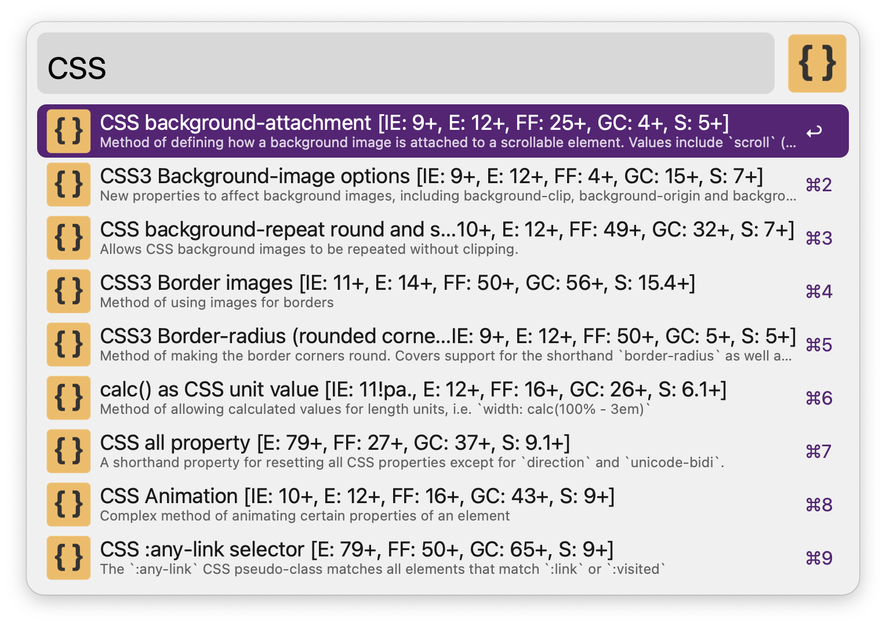

# Stand-alone Caniuse workflow for Alfred

Simple search for terms in the data of caniuse.com. The workflow does not rely on external languages like Python or PHP.

It searches the official exported JSON file on GitHub
https://raw.githubusercontent.com/Fyrd/caniuse/main/fulldata-json/data-2.0.json
for this. Query terms are looked for in the title, keywords and the JSON data's key.

**Note 1**: The file is updated whenever the local copy is older than a week.

**Note 2**: The data is _not_ complete, i.e. it is not the same as on caniuse.com. It's not clear yet why the exported data does not contain all the information from the website. 

Hotkey is Shift-Ctrl-Opt-Cmd C („Hyper-C“), keyword is 'cu'. Both can be modified, of course, as can be the JavaScript code in the script action.

The code is modeled after an earlier version by Will Farrell (https://github.com/willfarrell/alfred-caniuse-workflow) which relied on PHP. I also stole the icon from this workflow.

